# 🇵🇰 XPK – Explore Pakistan

**XPK (Explore Pakistan)** is a Flutter-based mobile application that helps users explore the beauty, culture, and hidden gems of Pakistan. Whether you're looking for historical landmarks, scenic spots, or trendy restaurants — XPK provides personalized recommendations based on your location and time availability.

---

## 📱 Features

- Discover tourist spots in cities like **Lahore**, **Karachi**, and **Murree**
- Filter places based on available time (e.g., 2 hours, 1 day, 3 days)
- Upload and explore **vlogs/blogs** from travelers
- **Turn on GPS** to get real-time nearby suggestions
- Smooth, user-friendly interface inspired by modern tourism trends

---

## 📸 Screenshots

> Here’s a preview of the XPK app experience:

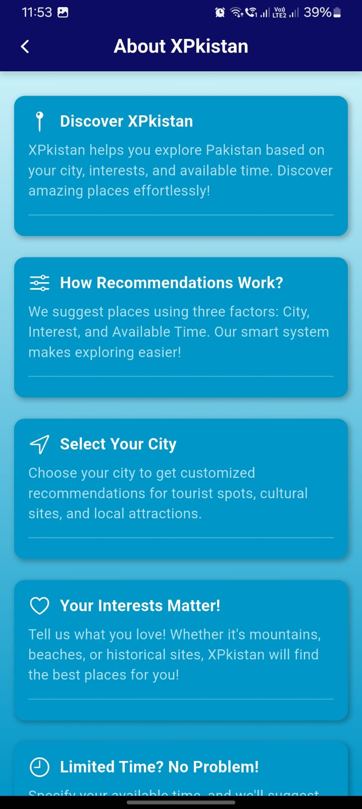
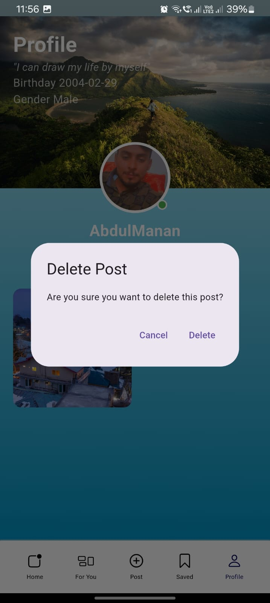
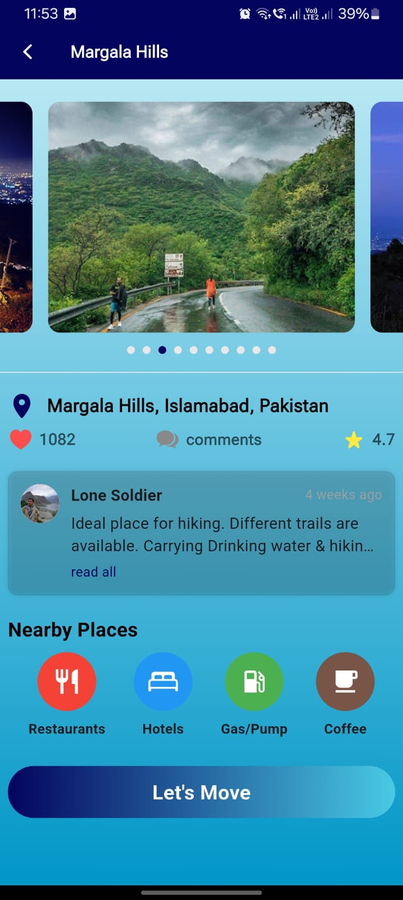
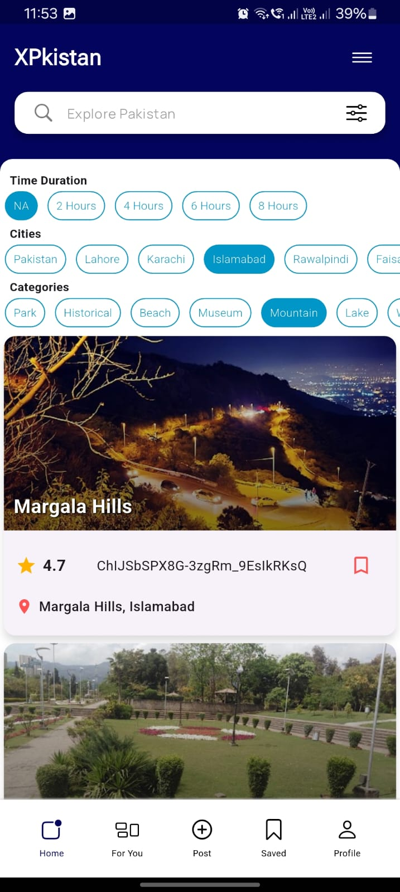
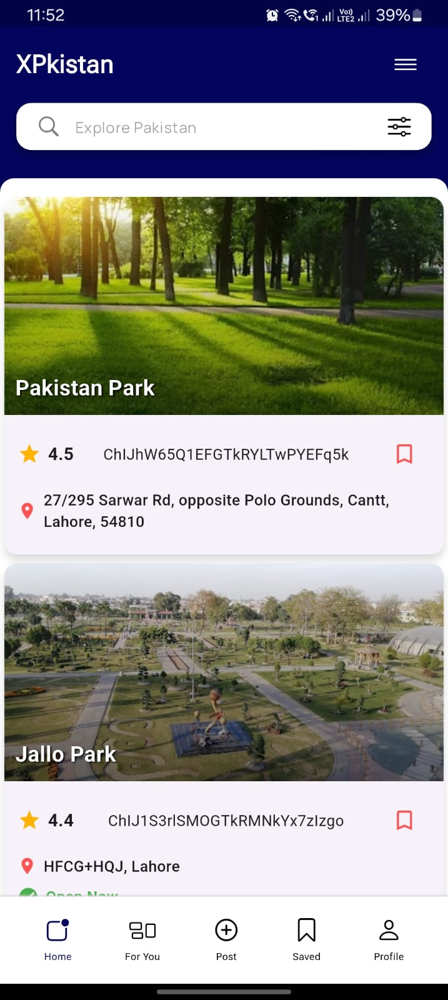
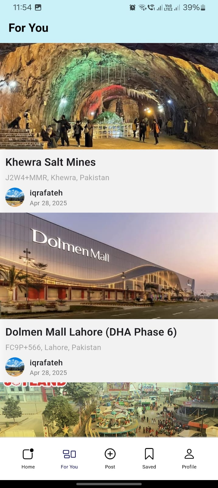
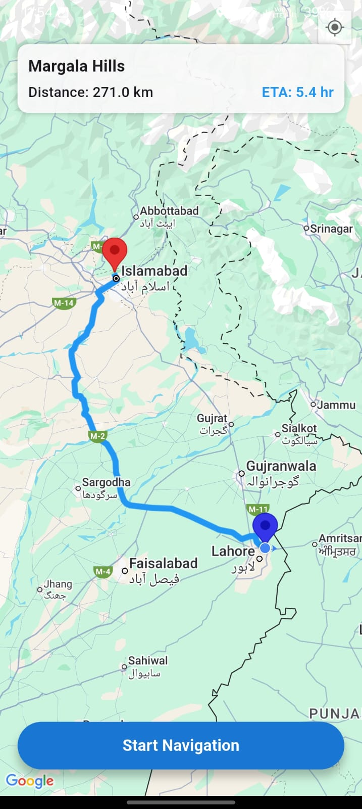
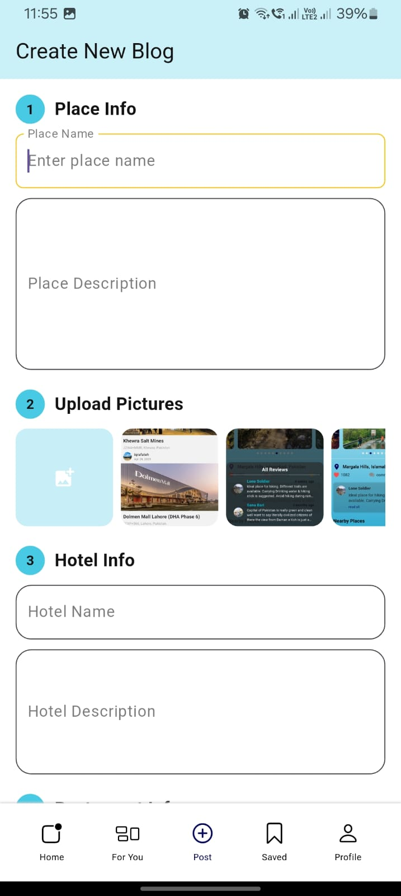
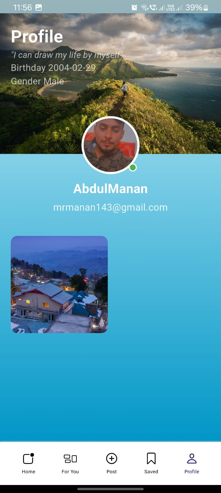
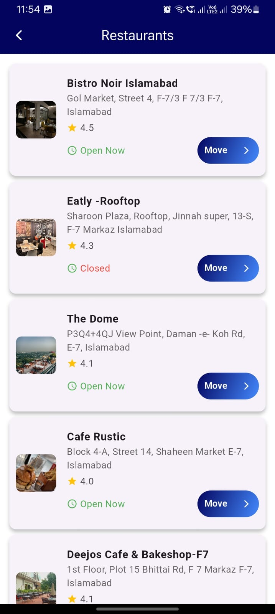
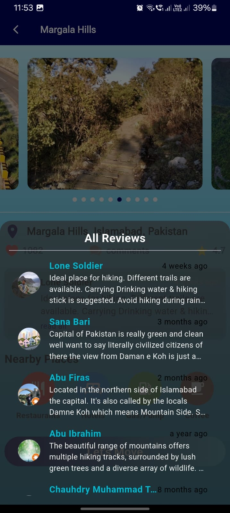
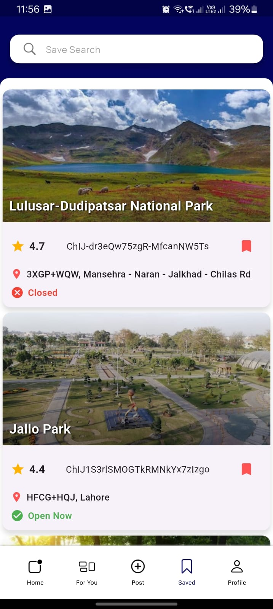

---

## 🛠️ Tech Stack

| Tool      | Version       |
|-----------|---------------|
| Flutter   | 3.27.2        |
| Dart      | 3.6.1         |
| DevTools  | 2.40.2        |
| Engine    | e672b006cb    |
| Channel   | Stable        |
| Release   | 68415ad1d9 (2025-01-13) |

---

## 🎨 UI/UX Design

> Full prototype and design screens are available on Figma:

🔗 [Figma Design – XPK](https://www.figma.com/design/kh2oypbo4jYNFDIddQtgcl/Xpk?node-id=0-1&p=f&t=7b54m1vESsON7eqK-0)

---

## 📄 Documentation

This repository includes complete documentation of the project:

- ✅ Project Proposal
- ✅ Software Requirements Specification (SRS)
- ✅ System Design & Architecture
- ✅ UI/UX Prototypes
- ✅ Final Presentation Slides
- ✅ Final Project Report

> All files are available in the `/documentation` folder.

---

## 🙋‍♂️ About Me

This project is developed by **Manan Saith**, a passionate Flutter developer from Pakistan 🇵🇰.  
Currently building real-world mobile solutions that empower users and showcase the best of technology and tourism.

---

## 📝 How to Add/Update Screenshots

1. Place your screenshot images in `document/material/images/`.
2. Use the Markdown format to insert them:

```markdown

